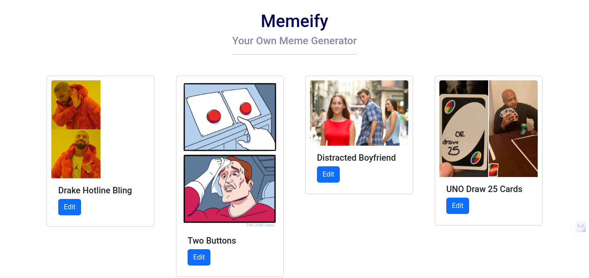
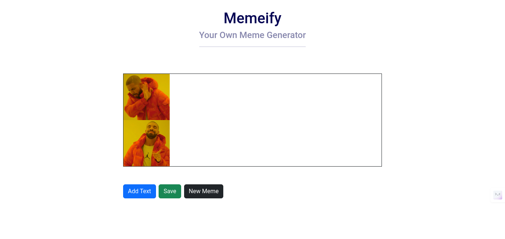
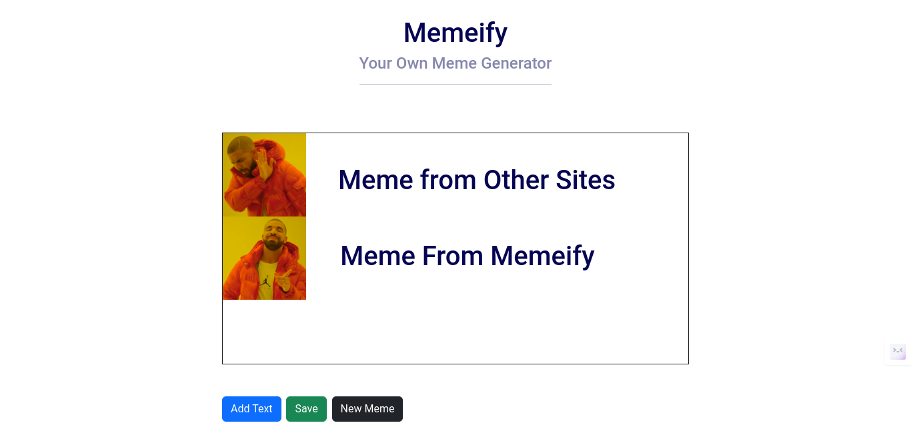

# Memeify

Live Project Link: [Memeify](https://memeify-avi.netlify.app/)

## Description

Memeify is a meme generator application built using React and Vite. It allows users to create custom memes by adding text to images and provides a collection of pre-existing memes for quick use.

## Features

- Generate memes by adding text to images.
- View a collection of pre-existing memes.
- Customize memes with adjustable text size and position.
- Export memes as JPEG images.
- Lightweight and easy-to-use interface.

## Screenshots

## Tech Used

- React
- Vite
- React Router
- Bootstrap
- react-bootstrap
- react-component-export-image
- react-draggable

## Installation

1. Clone the repository: `git clone https://github.com/your-username/memeify.git`
2. Navigate to the project directory: `cd memeify`
3. Install dependencies: `npm install`

## Usage

1. Start the development server: `npm run dev`
2. Open your browser and visit `http://localhost:3000` to view the app.

## Credits

- Created by [Aviral Sharma](https://github.com/aviralsharma07)
